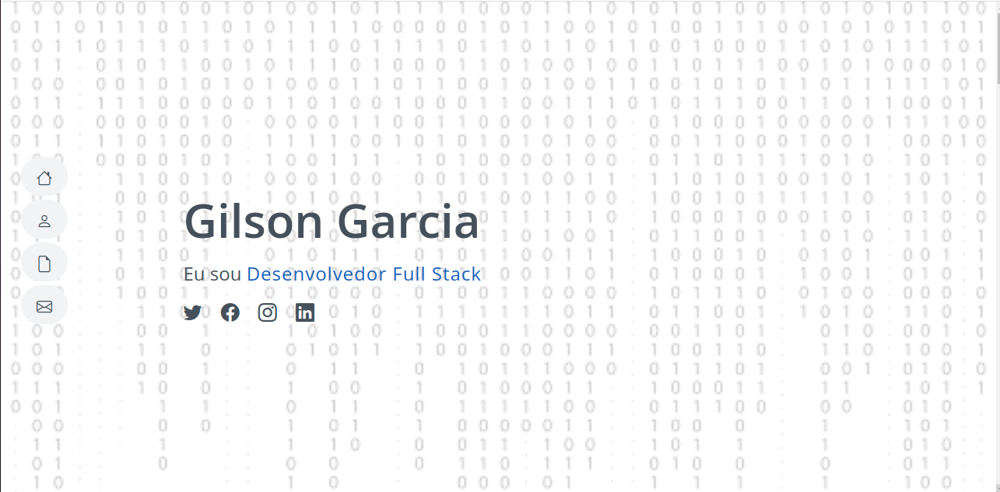

## Portfolio Gilson Garcia

### Screenshot do projeto.

### Desenvolvedor(a)
Gabriele Soares Quevedo

### Cliente
Gilson Garcia

### Tecnologias
- HTML
- CSS
- JQuery
- Bootstrap

### Ambiente de desenvolvimento
- VS Code

### Créditos
- Google Fonts
- Bootstrap Icons
- GitHub IO

### Bastidores
- Relembrei meus conhecimentos das tecnologias HTML, CSS e JQuery.
- Primeiro contato com o GitHub IO.

### Objetivo
- Site estático desenvolvido para a disciplina de desenvolvimento Web.
